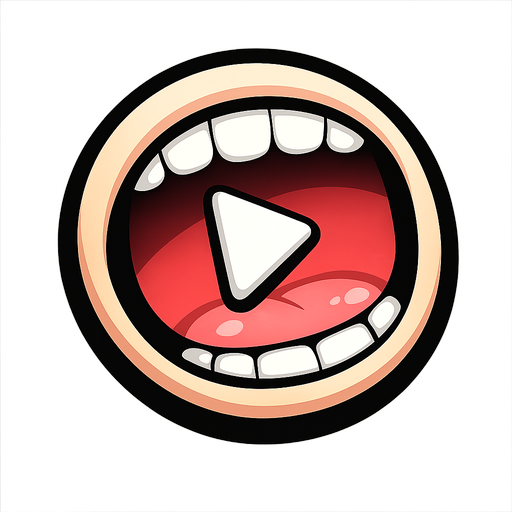
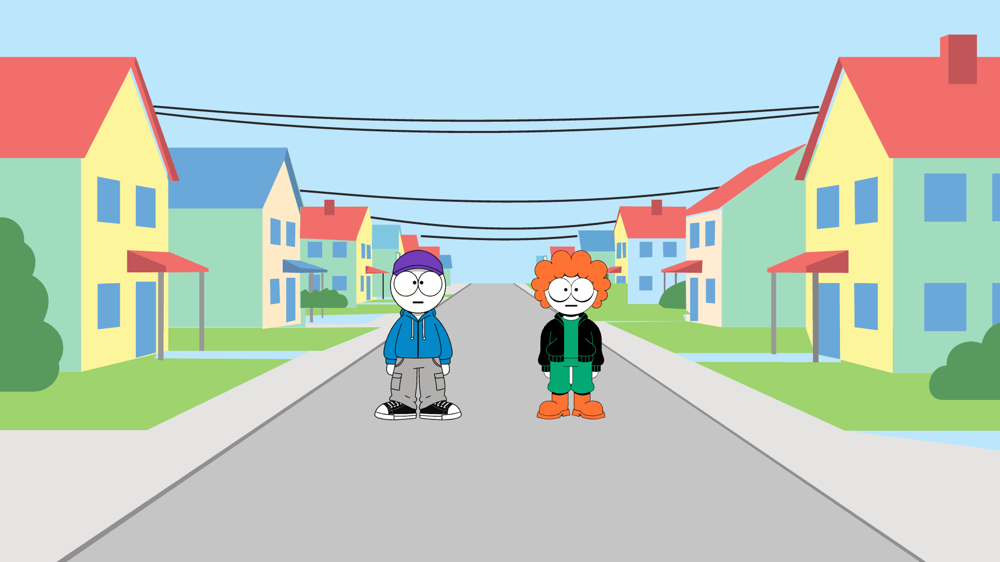
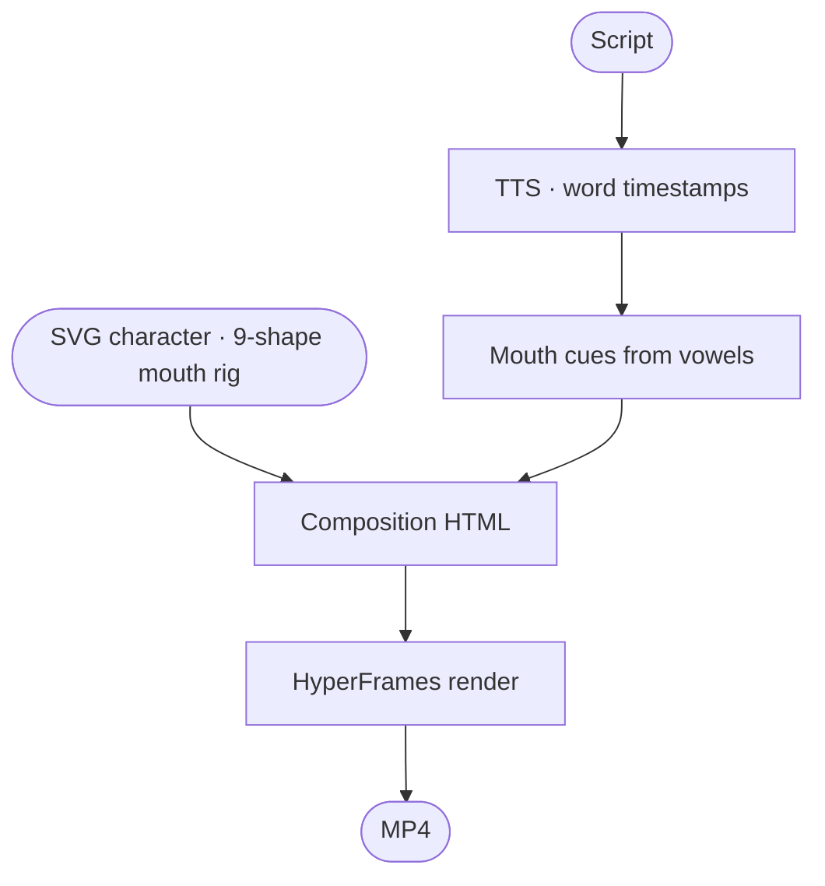

<div align="center">



# Cartoon Studio

**Create your own 2D animated cartoon show.**

An open-source desktop studio — script in, MP4 out. Bring your own API keys; no telemetry, no cloud.

[](LICENSE)
[](https://www.electronjs.org/)
[](https://nodejs.org)
[](https://github.com/Jellypod-Inc/cartoon-studio/stargazers)

**[Quick start](#quick-start)** · **[Three screens](#three-screens-three-jobs)** · **[How it works](#how-it-works)** · **[Built on](#built-on)** · **[API keys](#bring-your-own-api-keys)**

</div>

<br />



## Quick start

> **Heads up — no pre-built binaries yet.** Code signing and distribution are still being sorted out. For now, run from source. Works on macOS, Windows, and Linux.

You only need **Node ≥ 24** (the repo pins `24` via `.nvmrc` — run `nvm use` to match CI). `ffmpeg` and Chrome are bundled via `postinstall`.

```bash
git clone https://github.com/Jellypod-Inc/cartoon-studio.git
cd cartoon-studio
npm install      # also downloads chrome-headless-shell (~190 MB)
npm start
```

`npm start` boots a Vite dev server for the renderer and an Electron process for main + preload, with HMR on the renderer. The `postinstall` script downloads chrome-headless-shell once for your host platform; rerun `npm run setup:chrome` if it gets stale or you switch architectures.

## Three screens, three jobs

- **Stage** — drag SVG characters onto a scene. Library on the left, 1920×1080 canvas on the right. Move, resize from any corner, <kbd>Delete</kbd> to remove.
- **Dialogue** — write the script. Per-line speaker, voice (87 voices across 8 providers), and text. Press ▶ to generate a fresh take and play it inline. Press **✦ Write with AI** to author the whole script from a premise.
- **Play** — final-cut preview inside a film cabinet. Scrub, play, restart, render to MP4.

## How it works



What runs through an LLM and what doesn't:

- **LLM** — script authoring (OpenAI), vision-based mouth detection on uploaded SVGs (OpenAI vision).
- **Not LLM** — TTS, word-level alignment, mouth-cue generation (deterministic vowel heuristic), placement, composition, render. Output is reproducible from the same script + voices + characters.

## Built on

| Layer | Project | What it gives us |
| --- | --- | --- |
| **Speech** | [Speech SDK](https://github.com/Jellypod-Inc/speech-sdk) | One `generateSpeech()` call across **13 providers** with native or Whisper-derived word timestamps. Built and maintained by [Jellypod](https://jellypod.ai). The reason Cartoon Studio can swap voice providers from a dropdown. |
| **Render** | [HyperFrames](https://github.com/heygen-com/hyperframes) | HTML composition → MP4 via headless Chrome + GSAP timelines + ffmpeg. We hand it a paused timeline with `.set()` calls per mouth cue; HyperFrames seeks frame by frame and muxes the audio. |
| **SVG art** | [Recraft V4](https://fal.ai/models/fal-ai/recraft/v4/text-to-vector) | Text → flat construction-paper SVG characters and scenes. We hint a magenta background plate so it can be reliably stripped, then auto-rig the mouth via geometric heuristic (or vision-LLM fallback for unusual faces). |
| **Lip-sync catalog** | [Preston Blair · Rhubarb](https://github.com/DanielSWolf/rhubarb-lip-sync) | The 9 mouth shapes (X closed · A–H open variants) Rhubarb popularized. We don't bundle Rhubarb — cues come from word timestamps via a vowel-per-word heuristic, which is faster and regenerates instantly when the text changes. Rhubarb itself is excellent for true phoneme-driven sync. |

## Bring your own API keys

Every key lives encrypted in your OS keyring — macOS Keychain · Windows DPAPI · Linux GNOME Libsecret / KWallet — via Electron's `safeStorage`. The settings file holds only ciphertext, with file mode `0600` on Unix. The renderer process never sees plaintext keys, only an "is set" boolean map. Audit all of this in **Settings → SC.SEC · Key Vault**.

The app boots fine with no keys. Every key is optional; nothing is gated. If a key isn't set when an action needs it, you get a single editorial toast with a one-click "Open Settings" shortcut.

### Dialogue & scenes

| Key | Used for |
| --- | --- |
| `OPENAI_API_KEY` | Script authoring · vision-based mouth detection on uploaded SVGs · OpenAI TTS · Whisper word alignment for any provider without native timestamps. |
| `FAL_API_KEY` | Recraft V4 character + scene generation. |

### Text-to-speech

| Key | Provider · what it's good for |
| --- | --- |
| `ELEVENLABS_API_KEY` | ElevenLabs — best voice quality, native word-level timestamps. |
| `GOOGLE_API_KEY` | Google Gemini 3.1 Flash TTS — 30 expressive voices. |
| `CARTESIA_API_KEY` | Cartesia Sonic-3 — ultra-low latency, expressive character voices. |
| `DEEPGRAM_API_KEY` | Deepgram Aura-2 — natural conversational voices. |
| `HUME_API_KEY` | Hume Octave-2 — emotionally intelligent, prompt-steerable. |
| `FISH_AUDIO_API_KEY` | Fish Audio S2-Pro — paste reference IDs from fish.audio. |
| `INWORLD_API_KEY` | Inworld TTS-1.5-Max — character voices built for game/agent NPCs. |

## Build a binary for your machine

```bash
npm run make
```

Squirrel installer on Windows · `.zip` containing the `.app` on macOS · `.deb` / `.rpm` on Linux. Output lands in `out/`.

> **Signing.** Builds are unsigned — on macOS you'll hit Gatekeeper ("damaged / can't be opened") and possibly Keychain access issues since the Fuses plugin invalidates the ad-hoc signature. On Windows you'll see SmartScreen. These go away once we ship signed builds via an Apple Developer ID + Authenticode certificate.

## Project layout

```
src/
  main/        Electron main — settings, IPC, TTS, render, composition
  preload/     contextBridge exposing IpcApi to the renderer
  renderer/    Vanilla TS + Tailwind 4 — screens, modals, design system
    screens/   Stage / Dialogue / Play
  shared/      Cross-process types
resources/
  defaults/    Bundled characters (Bill · Ted · Jane · Max) + scenes
scripts/       CLI tools (e.g. `npm run rig` for SVG mouth-rigging)
docs/          Repo media
```

Forge is configured to:

- Bundle `resources/defaults/` as `extraResource` so default characters & scenes ship with the app.
- Unpack `node_modules/hyperframes/**` from the asar so the render child process can resolve the CLI entry.

---

<div align="center">

<a href="https://jellypod.ai">
  
</a>

**Sponsored by [Jellypod](https://jellypod.ai)**

</div>
